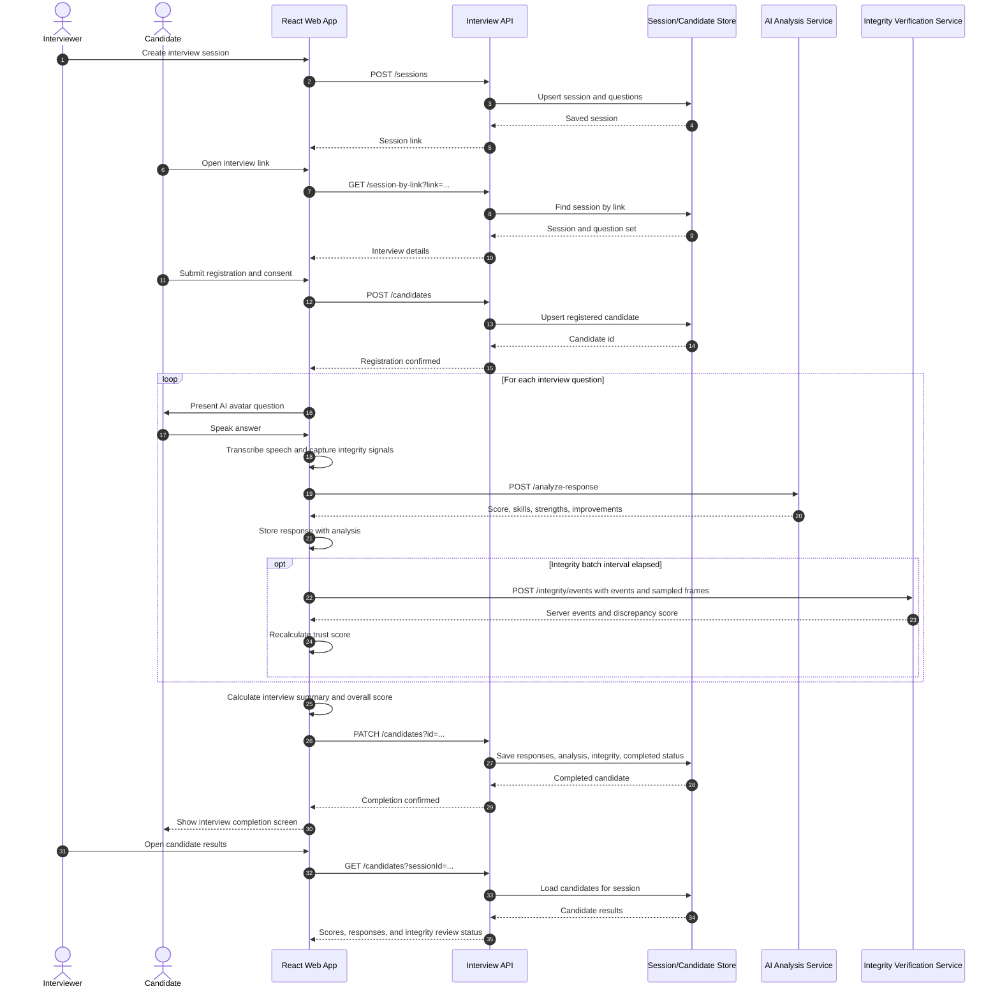
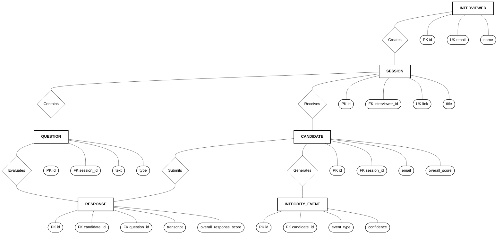

# AI Interview Platform Diagrams

## Interview flow sequence diagram

## Entity relationship diagram

### Storage note

This Chen-style ERD uses rectangles for entities, ovals for attributes, and diamonds for relationships. The MySQL adapter creates six normalized tables. `sessions`, `questions`, `candidates`, `responses`, and `integrity_events` use real foreign keys with cascade rules. JSON attributes remain marked with `JSON`, and `question_id` in `responses` is nullable.
